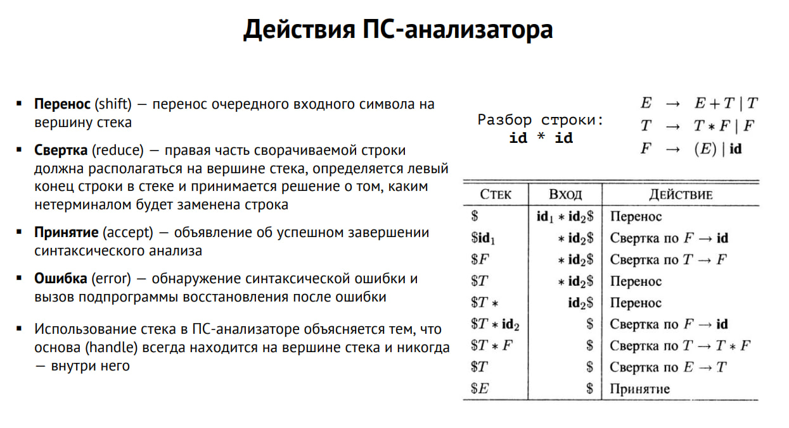

### Синтаксический анализ. Восходящий синтаксический анализ. Свертки. Обрезка основ. Конфликты в процессе ПС-анализа. Простой LR-анализатор. Алгоритм LR-анализа.

#### Синтаксический анализ

**Синтаксический анализ** (Parsing) — процесс проверки последовательности токенов на соответствие грамматике языка программирования и построения синтаксического дерева.

#### Восходящий синтаксический анализ


**Восходящий синтаксический анализ** (Bottom-Up Parsing) строит синтаксическое дерево от листьев (токенов входной строки) к корню (стартовому символу грамматики). Этот метод подходит для более широкого класса грамматик по сравнению с нисходящим анализом.

#### Свертки (Reductions)

**Свертка** — это процесс замены последовательности символов на ее порождающий нетерминал согласно правилам грамматики. Свертка начинается с токенов (листьев дерева) и продолжается до тех пор, пока не будет получен стартовый символ грамматики (корень дерева).

##### Пример:
Для грамматики:
```
E -> E + E
E -> E * E
E -> id
```
Входная строка: `id + id * id`

Процесс свертки:
1. Сканируем `id` и сворачиваем его в `E`.
2. Сканируем `+` и `id`, сворачиваем его в `E`.
3. Сканируем `*` и `id`, сворачиваем его в `E`.
4. Сворачиваем весь результат в `E`.


#### Обрезка основ (Shift)

**Обрезка основ** (Shift) — это процесс перемещения следующего токена из входной строки в стек. Восходящий синтаксический анализатор чередует обрезку и свертку, пока не будет достигнут полный разбор.

##### Пример:
Для входной строки `id + id` и грамматики:
```
E -> E + id
E -> id
```
Процесс разбора:
1. Обрезка `id` (сдвиг в стек).
2. Сворачиваем `id` в `E`.
3. Обрезка `+`.
4. Обрезка `id`.
5. Сворачиваем `id` в `E`.
6. Сворачиваем `E + E` в `E`.

#### Конфликты в процессе ПС-анализа


**Конфликты в процессе ПС-анализа** (Shift-Reduce Conflicts) возникают, когда анализатор не может однозначно решить, делать ли обрезку или свертку. Также возможны **Reduce-Reduce Conflicts**, когда несколько правил могут быть свернуты одновременно.

##### Пример конфликта:
Для грамматики:
```
E -> E + E
E -> E * E
E -> id
```
Входная строка: `id + id * id`

На стадии `id + id` анализатор может либо сворачивать `id + id` в `E`, либо продолжать обрезку и ждать `*`.

#### Простой LR-анализатор (SLR)

**Простой LR-анализатор (SLR)** — это тип LR-анализатора, который использует таблицы действий (Action Table) и переходов (Goto Table) для управления процессом разбора. SLR-анализатор базируется на LR(0)-автомате с добавлением множества следования (Follow Sets) для управления свертками.

##### Основные компоненты SLR-анализатора:
1. **Action Table**: указывает, следует ли выполнять обрезку, свертку или принять строку.
2. **Goto Table**: определяет переходы между состояниями для нетерминалов.
3. **Стек**: хранит состояния и символы, необходимые для разбора.

##### Пример работы SLR-анализатора:
Для грамматики:
```
E -> E + T
E -> T
T -> T * F
T -> F
F -> ( E )
F -> id
```
Таблицы разбора:

Action Table:
| State | id | +  | *  | (  | )  | $  |
|-------|----|----|----|----|----|----|
|   0   | S5 |    |    | S4 |    |    |
|   1   |    | S6 |    |    |    | Acc|
|   2   |    | R2 | S7 |    | R2 | R2 |
|   3   |    | R4 | R4 |    | R4 | R4 |
|   4   | S5 |    |    | S4 |    |    |
|   5   |    | R6 | R6 |    | R6 | R6 |
|   6   | S5 |    |    | S4 |    |    |
|   7   | S5 |    |    | S4 |    |    |

Goto Table:
| State | E  | T  | F  |
|-------|----|----|----|
|   0   | 1  | 2  | 3  |
|   4   | 8  | 2  | 3  |
|   6   |    | 9  | 3  |
|   7   |    |    | 10 |


#### Алгоритм LR-анализа



**Алгоритм LR-анализа** (Left-to-right, Rightmost derivation) управляется таблицами и стеком. Он использует следующее:

1. **Инициализация**: в стек помещаются начальное состояние и символ `$`.
2. **Action Table**: определяет, следует ли выполнять обрезку, свертку или принять строку.
3. **Goto Table**: используется для переходов между состояниями после свертки.
4. **Сдвиг (Shift)**: перемещает следующий символ из входной строки в стек.
5. **Свертка (Reduce)**: заменяет несколько символов в стеке на их нетерминал по правилу грамматики.
6. **Принятие (Accept)**: завершает разбор, если входная строка полностью разобрана.

##### Пример работы:
Для входной строки `id + id * id` и приведенной выше грамматики.

1. Стек: 0, Вход: id + id * id$
2. Action[0, id] = S5 -> Стек: 0, id, 5, Вход: + id * id$
3. Action[5, +] = R6 (F -> id) -> Стек: 0, F, 3
4. Goto[0, F] = 3 -> Стек: 0, F, 3
5. Action[3, +] = R4 (T -> F) -> Стек: 0, T, 2
6. Goto[0, T] = 2 -> Стек: 0, T, 2
7. Action[2, +] = S6 -> Стек: 0, T, 2, +, 6, Вход: id * id$
8. Action[6, id] = S5 -> Стек: 0, T, 2, +, 6, id, 5, Вход: * id$
9. Action[5, *] = R6 (F -> id) -> Стек: 0, T, 2, +, T, 9
10. Goto[6, F] = 3 -> Стек: 0, T, 2, +, T, 9
11. Action[9, *] = S7 -> Стек: 0, T, 2, +, T, 9, *, 7, Вход: id$
12. Action[7, id] = S5 -> Стек: 0, T, 2, +, T, 9, *, id, 5, Вход: $
13. Action[5, $] = R6 (F -> id) -> Стек: 0, T, 2, +, T, 9, *, F, 10
14. Goto[7, F] = 3 -> Стек: 0, T, 2, +, T, 9, *, F, 10
15. Action[10, $] = R4 (T -> T * F) -> Стек: 0, T, 2, +, T, 9
16. Action[9, $] = R2 (E -> T) -> Стек: 0, E, 1
17. Goto[0, E] = 1 -> Стек: 0, E, 1
18. Action[1, $] = Acc -> Принятие

### Заключение

Восходящий синтаксический анализ является мощным методом разбора, позволяющим обрабатывать широкий класс грамматик. Простой LR-анализатор и алгоритм LR-анализа используют таблицы действий и переходов для эффективного управления процессом разбора, чередуя сдвиги и св

ертки. Эти методы обеспечивают точное и эффективное построение синтаксического дерева, что делает их важными инструментами в компиляторных технологиях.
