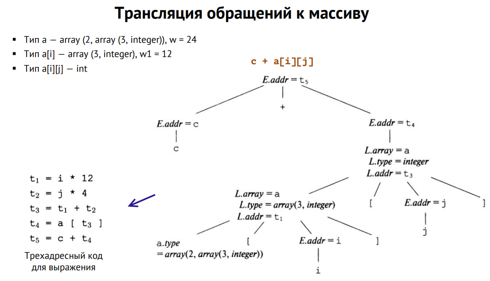
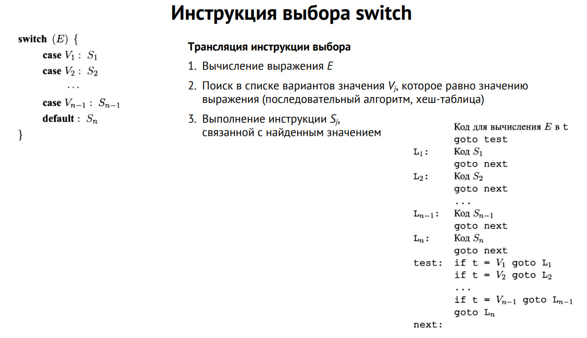

### Генерация промежуточного кода. Трансляция обращений к массиву

#### Трансляция обращений к массиву

Обращения к массиву требуют вычисления адреса элемента на основе индекса и, возможно, размеров элементов. Пусть `A` — массив, `i` — индекс элемента, а `base` — базовый адрес массива. Размер одного элемента массива обозначим как `size`.

Для простоты рассмотрим одномерный массив. Формула вычисления адреса элемента:
```
address = base + i * size
```

##### Пример:
```
A[i]
```
Пусть `base` — базовый адрес массива `A`, `size` — размер элемента массива.

Промежуточный код:
```
t1 = i * size
t2 = base + t1
```

Для многомерного массива, например `A[i][j]`, требуется учитывать размеры всех измерений. Пусть `width` — число столбцов.

Формула вычисления адреса элемента:
```
address = base + (i * width + j) * size
```

##### Пример:
```
A[i][j]
```
Пусть `base` — базовый адрес массива `A`, `width` — число столбцов, `size` — размер элемента массива.

Промежуточный код:
```
t1 = i * width
t2 = t1 + j
t3 = t2 * size
t4 = base + t3
```

<br><br>

### Генерация промежуточного кода. Вычисления булевых выражений по сокращенной схеме

#### Трансляция булевых выражений

Сокращенная схема вычисления булевых выражений (short-circuit evaluation) позволяет избежать вычисления всех частей выражения, если результат уже ясен. 

##### Логическое И (AND):
Выражение: `a && b`
- Если `a` ложь (`false`), то `b` не вычисляется, результат `false`.
- Если `a` истина (`true`), то результат зависит от `b`.

##### Пример:
```
a && b
```

Промежуточный код:
```
if a == false goto L1
if b == true goto L2
L1:
t1 = false
goto L3
L2:
t1 = true
L3:
```

##### Логическое ИЛИ (OR):
Выражение: `a || b`
- Если `a` истина (`true`), то `b` не вычисляется, результат `true`.
- Если `a` ложь (`false`), то результат зависит от `b`.

##### Пример:
```
a || b
```

Промежуточный код:
```
if a == true goto L1
if b == true goto L1
t1 = false
goto L2
L1:
t1 = true
L2:
```
<br><br>
### Генерация промежуточного кода. Трансляция if-then-else

#### Трансляция if-then-else

Конструкция `if-then-else` требует условного перехода в промежуточном коде. Ветвление на основе условия осуществляется с помощью инструкций условного и безусловного переходов.

##### Пример:
```
if (a > b) {
    S1;
} else {
    S2;
}
```

Промежуточный код:
```
if a > b goto L1
goto L2
L1:
    S1
    goto L3
L2:
    S2
L3:
```
<br><br>
### Генерация промежуточного кода. Трансляция цикла while

#### Трансляция цикла while

Конструкция `while` требует создания цикла с условным проверочным переходом.

##### Пример:
```
while (a < b) {
    S;
}
```

Промежуточный код:
```
L1:
if a >= b goto L2
    S
goto L1
L2:
```

### Switch


### Заключение

Трансляция выражений для обращений к массиву, булевых выражений по сокращенной схеме, конструкций `if-then-else` и циклов `while` требует генерирования промежуточного кода с использованием арифметических и логических операций, а также инструкций условных и безусловных переходов. Эти схемы позволяют эффективно и точно реализовать логику исходного кода на уровне промежуточного представления, готового к дальнейшей оптимизации и генерации машинного кода.
