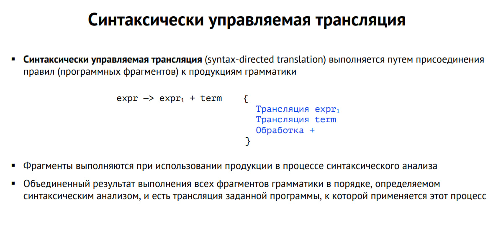
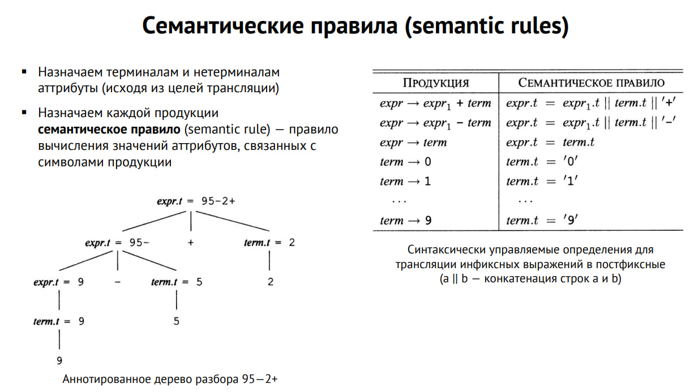
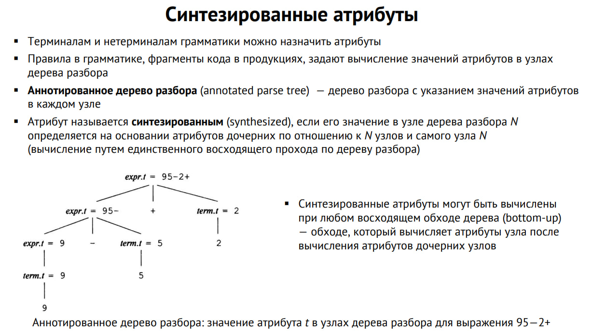

### Синтаксически управляемая трансляция. Деревья разбора. Семантические правила.



#### Синтаксически управляемая трансляция

**Синтаксически управляемая трансляция** (Syntax-Directed Translation, SDT) — это метод, используемый в компиляторах для связывания семантических действий с грамматическими правилами. Эти действия выполняются при построении синтаксического дерева или анализе входной строки, чтобы генерировать выходной код или промежуточное представление программы.

##### Элементы SDT:

1. **Атрибуты**: значения, связанные с узлами дерева разбора. Атрибуты могут быть двух типов:
   - **Синтезируемые атрибуты** (Synthesized attributes): вычисляются на основе атрибутов дочерних узлов.
   - **Наследуемые атрибуты** (Inherited attributes): передаются от родительских или соседних узлов.

2. **Семантические действия**: процедуры или инструкции, которые выполняются, когда применяется правило грамматики. Они могут изменять атрибуты, генерировать промежуточный код или выполнять другие действия.

##### Пример SDT:
```
E -> E1 + T { E.val = E1.val + T.val }
T -> T1 * F { T.val = T1.val * F.val }
F -> (E) { F.val = E.val }
F -> id { F.val = id.val }
```
Здесь `E.val`, `T.val`, и `F.val` — это синтезируемые атрибуты.

#### Деревья разбора

**Дерево разбора** (Parse Tree) — это дерево, которое представляет синтаксическую структуру входной строки согласно правилам грамматики. Узлы дерева разбора соответствуют символам грамматики (терминалам и нетерминалам), а листья — терминалам входной строки.

##### Пример дерева разбора:
Для выражения `3 + 4 * 5` и грамматики:
```
E -> E + T | T
T -> T * F | F
F -> (E) | id
```
Дерево разбора будет выглядеть так:
```
      E
     /|\
    E + T
   /   /|\
  T   T * F
 /   /     \
F   F       id
|   |       |
id  id      5
|   |
3   4
```

#### Семантические правила

**Семантические правила** — это инструкции, которые определяют, как вычисляются атрибуты в узлах дерева разбора. Эти правила могут быть ассоциированы с продукциями грамматики.

##### Пример семантических правил:
Для вышеуказанной грамматики семантические правила могут быть следующими:
```
E -> E + T { E.val = E1.val + T.val }
T -> T * F { T.val = T1.val * F.val }
F -> (E) { F.val = E.val }
F -> id { F.val = id.val }
```
Здесь `E.val`, `T.val`, и `F.val` — синтезируемые атрибуты, которые используются для вычисления значений в соответствующих узлах дерева разбора.



##### Наследуемые и синтезируемые атрибуты:
- **Синтезируемые атрибуты**: вычисляются на основе значений дочерних узлов.
- **Наследуемые атрибуты**: передаются от родительских или соседних узлов.



##### Пример использования атрибутов:
```
E -> T E'
E' -> + T { E'.inh = E.inh + T.val } E'1 { E.val = E'1.val }
E' -> ε { E.val = E.inh }
T -> id { T.val = id.val }
```
Здесь `E'` и `E'1` имеют синтезируемые атрибуты `val` и наследуемые атрибуты `inh`.

### Пример SDT в реальном языке программирования

Рассмотрим пример из языков программирования с выражениями и операциями:
```
expr -> expr + term { expr.val = expr1.val + term.val }
      | term { expr.val = term.val }

term -> term * factor { term.val = term1.val * factor.val }
      | factor { term.val = factor.val }

factor -> ( expr ) { factor.val = expr.val }
       | num { factor.val = num.val }
```
Для выражения `3 + 5 * 2` синтаксически управляемая трансляция будет выглядеть следующим образом:
```
expr -> expr + term
     -> term + term
     -> factor + term
     -> num + term
     -> 3 + term
     -> 3 + term * factor
     -> 3 + factor * factor
     -> 3 + num * factor
     -> 3 + 5 * factor
     -> 3 + 5 * num
     -> 3 + 5 * 2
```
В процессе трансляции используются семантические правила для вычисления значений выражений.
