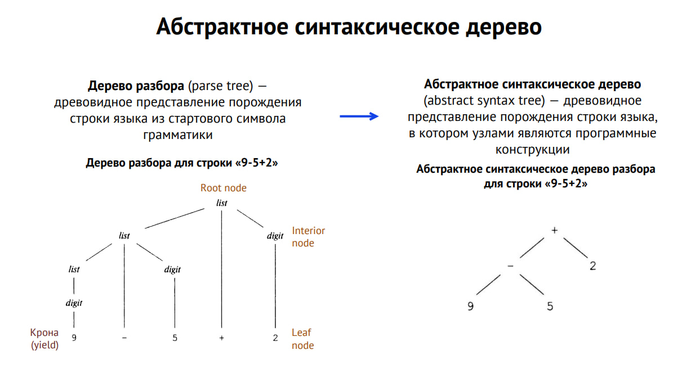

### Нисходящий анализ. Анализ методом рекурсивного спуска. Левая рекурсия в продукциях. Абстрактное синтаксическое дерево.

#### Нисходящий анализ

**Нисходящий анализ** (Top-Down Parsing) — это метод синтаксического анализа, который строит дерево разбора от корня к листьям. Нисходящий анализ начинается с стартового символа грамматики и пытается последовательно сопоставить входную строку с продукциями грамматики.

Основные методы нисходящего анализа:
1. **Анализ методом рекурсивного спуска**.
2. **LL-анализ**.

#### Анализ методом рекурсивного спуска

**Анализ методом рекурсивного спуска** (Recursive Descent Parsing) — это простой и интуитивный метод нисходящего синтаксического анализа, в котором для каждого нетерминала грамматики существует отдельная рекурсивная функция. Каждая функция пытается распознать часть входной строки, соответствующую своему нетерминалу, и вызывает другие функции для нетерминалов, присутствующих в правой части своих продукций.

##### Пример:

Рассмотрим грамматику для простых арифметических выражений:
```
E -> T E'
E' -> + T E' | ε
T -> F T'
T' -> * F T' | ε
F -> ( E ) | id
```


Пример кода на Python для рекурсивного спуска:
```python
tokens = ...  # список токенов входной строки
current_token = 0

def match(expected_token):
    global current_token
    if tokens[current_token] == expected_token:
        current_token += 1
    else:
        raise SyntaxError(f"Expected {expected_token}, found {tokens[current_token]}")

def E():
    T()
    E_prime()

def E_prime():
    if tokens[current_token] == '+':
        match('+')
        T()
        E_prime()

def T():
    F()
    T_prime()

def T_prime():
    if tokens[current_token] == '*':
        match('*')
        F()
        T_prime()

def F():
    if tokens[current_token] == '(':
        match('(')
        E()
        match(')')
    elif tokens[current_token] == 'id':
        match('id')
    else:
        raise SyntaxError(f"Unexpected token: {tokens[current_token]}")

# Запуск анализа
E()
if current_token < len(tokens):
    raise SyntaxError("Unexpected end of input")
```

#### Левая рекурсия в продукциях

**Левая рекурсия** — это ситуация, когда в грамматике присутствует продукция вида `A -> Aα`, где `A` — нетерминал, а `α` — любая строка символов. Левая рекурсия вызывает проблемы для рекурсивного спуска, так как приводит к бесконечной рекурсии.

##### Пример левой рекурсии:
```
E -> E + T | T
```

Для устранения левой рекурсии можно преобразовать грамматику:
```
E -> T E'
E' -> + T E' | ε
```

#### Абстрактное синтаксическое дерево

**Абстрактное синтаксическое дерево (AST)** — это упрощённое представление синтаксической структуры программы, которое фокусируется на важной семантической информации и опускает несущественные синтаксические детали (например, круглые скобки, знаки пунктуации).

##### Пример:
Для выражения `3 + 4 * 5` дерево разбора (Parse Tree) будет выглядеть так:

```
      E
     /|\
    E + T
   /   /|\
  T   T * F
 /   /     \
F   F       id
|   |       |
id  id      5
|   |
3   4
```

Абстрактное синтаксическое дерево (AST) для того же выражения будет следующим:

```
    +
   / \
  3   *
     / \
    4   5
```

В AST сохраняется только структурная информация, необходимая для последующих этапов компиляции или интерпретации.




### Заключение

Нисходящий анализ, особенно метод рекурсивного спуска, является простым и эффективным методом синтаксического анализа, подходящим для грамматик без левой рекурсии. Абстрактные синтаксические деревья упрощают последующую обработку кода, сохраняя только существенные элементы его структуры.
