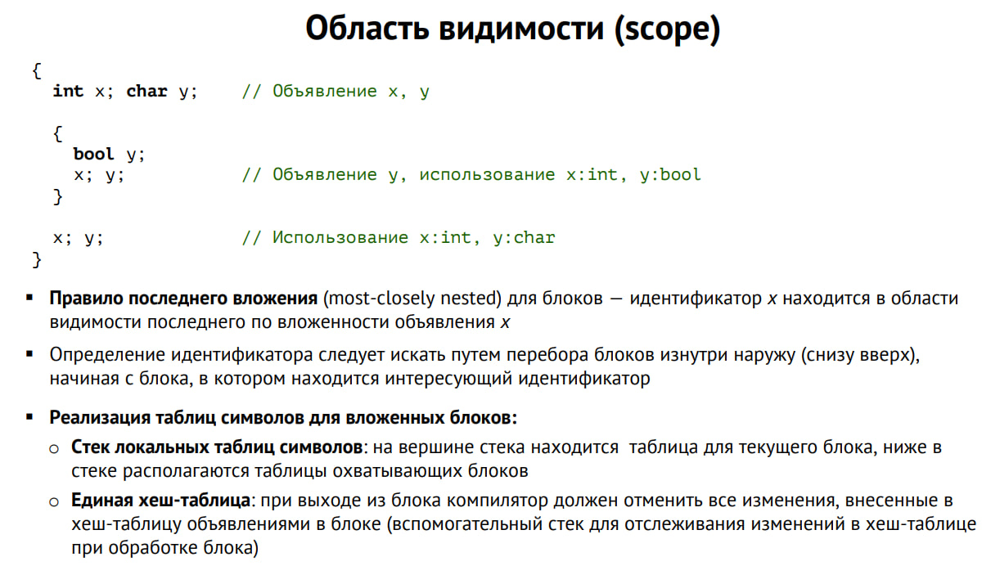

### Таблица символов. Область видимости. Цепочки таблиц символов. Лексический анализ. Регулярные выражения. Архитектура лексического анализатора на основе диаграммы переходов.

#### Таблица символов

**Таблица символов** (Symbol Table) — это структура данных, используемая компиляторами для хранения информации о различных идентификаторах (переменных, функциях, типах и т.д.), используемых в исходном коде. Таблица символов обеспечивает эффективный доступ к этой информации во время компиляции.

##### Основные функции таблицы символов:
- **Вставка**: добавление новых идентификаторов.
- **Поиск**: нахождение информации об идентификаторе.
- **Удаление**: удаление идентификаторов (обычно при выходе из области видимости).
- **Обновление**: изменение информации об идентификаторах.

##### Пример информации, хранящейся в таблице символов:
- Имя идентификатора.
- Тип идентификатора (переменная, функция, тип и т.д.).
- Область видимости.
- Адрес в памяти или смещение.
- Другие атрибуты (например, константность, параметры функции).


#### Область видимости

**Область видимости** (Scope) — это часть программы, в пределах которой идентификатор (переменная, функция и т.д.) является видимым и может быть использован.

##### Виды областей видимости:
- **Локальная область видимости**: идентификатор виден только внутри блока кода (например, внутри функции или блока).
- **Глобальная область видимости**: идентификатор виден во всей программе.
- **Вложенные области видимости**: внутренние области видимости могут переопределять идентификаторы из внешних областей видимости.



#### Цепочки таблиц символов

**Цепочки таблиц символов** (Symbol Table Chains) — это механизм, позволяющий поддерживать вложенные области видимости. Для каждой новой области видимости создается новая таблица символов, которая ссылается на таблицу символов родительской области видимости.

##### Пример:
```
void function() {
    int x;      // Локальная переменная в функции
    {
        int y;  // Локальная переменная в блоке
    }
}
```
В данном примере создаются две таблицы символов: одна для функции, другая для внутреннего блока.


#### Лексический анализ

**Лексический анализ** (Lexical Analysis) — это первый этап компиляции, на котором исходный код разбивается на токены — элементарные синтаксические единицы (ключевые слова, идентификаторы, операторы, литералы и т.д.).

##### Основные задачи лексического анализатора:
- Чтение исходного кода.
- Распознавание токенов.
- Игнорирование пробелов и комментариев.
- Обработка ошибок на уровне лексики.

#### Регулярные выражения

**Регулярные выражения** (Regular Expressions) — это формальные языковые конструкции, используемые для описания шаблонов строк. В лексическом анализе регулярные выражения применяются для определения шаблонов токенов.

##### Пример регулярных выражений для токенов:
- Идентификатор: `[a-zA-Z_][a-zA-Z0-9_]*`
- Целое число: `[0-9]+`
- Пробелы: `[ \t\n\r]+`

#### Архитектура лексического анализатора на основе диаграммы переходов

**Диаграммы переходов** (Transition Diagrams) — это графы, где вершины представляют состояния, а ребра — переходы между состояниями, вызванные чтением символов. Лексический анализатор на основе диаграмм переходов моделирует конечный автомат.

##### Основные компоненты диаграммы переходов:
- **Начальное состояние** (Start State).
- **Конечные состояния** (Accepting States).
- **Переходы** (Transitions), помеченные символами или классами символов.

##### Пример:
Рассмотрим простой лексический анализатор для чисел и идентификаторов:
```
(START) --> [a-zA-Z] --> (ID_STATE) -- [a-zA-Z0-9] --> (ID_STATE)
(START) --> [0-9] --> (NUM_STATE) -- [0-9] --> (NUM_STATE)
(ID_STATE) --> [^a-zA-Z0-9] --> (ACCEPT_ID)
(NUM_STATE) --> [^0-9] --> (ACCEPT_NUM)
```

В этом примере `START` — начальное состояние, `ID_STATE` — состояние распознавания идентификатора, `NUM_STATE` — состояние распознавания числа, `ACCEPT_ID` и `ACCEPT_NUM` — конечные состояния.

### Заключение

Таблицы символов, области видимости и цепочки таблиц символов играют ключевую роль в управлении идентификаторами и их областями видимости в компиляторе. Лексический анализ, используя регулярные выражения и диаграммы переходов, обеспечивает эффективное разбиение исходного кода на токены, подготавливая его к дальнейшим этапам синтаксического и семантического анализа.
