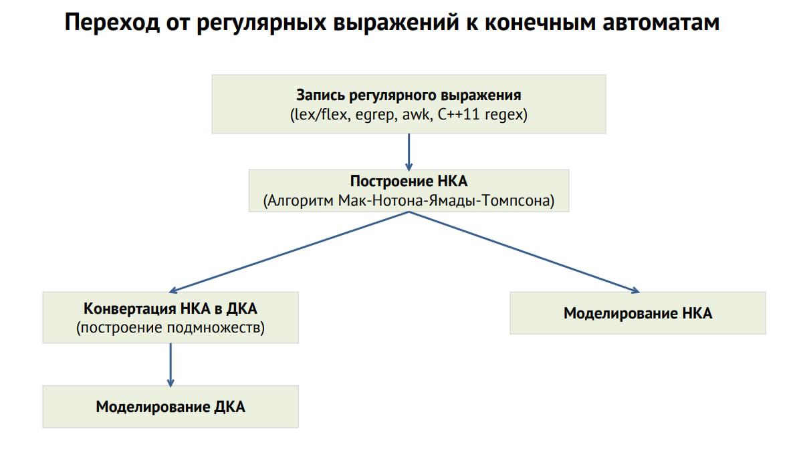

### Переход от регулярных выражений к конечным автоматам. Построение НКА. Конвертация НКА в ДКА. Моделирование НКА.

#### Переход от регулярных выражений к конечным автоматам



Регулярные выражения (РВ) часто используются для описания токенов в лексическом анализе. Чтобы распознавать эти токены, регулярные выражения преобразуются в конечные автоматы (КА), которые можно эффективно реализовать в виде программ.

#### Построение НКА (Недетерминированного Конечного Автомата)


**Недетерминированный конечный автомат (НКА)** — это автомат, который может находиться в нескольких состояниях одновременно или делать переходы без чтения символов (ε-переходы).

##### Основные шаги построения НКА из регулярного выражения:
1. **Конкатенация** (Concatenation): для РВ `ab` создается НКА, последовательно соединяющий автоматы для `a` и `b`.
2. **Объединение** (Union): для РВ `a|b` создается НКА, который может перейти в автомат для `a` или `b`.
3. **Клебе замыкание** (Kleene Star): для РВ `a*` создается НКА, который позволяет многократные (или нулевые) повторения `a`.

##### Пример построения НКА:
Для регулярного выражения `a|b*` НКА будет следующим:
```
       ε
    -->0--->1--->a--->2
    |        |
    |        ε
    |        v
    +--->3--->b--->3
          ^
          |
          ε
```
В этом примере 0 — начальное состояние, 2 и 3 — конечные состояния.

#### Конвертация НКА в ДКА


**Детерминированный конечный автомат (ДКА)** — это автомат, который в каждый момент времени находится в одном состоянии и делает переходы только по прочитанным символам, без ε-переходов.

##### Алгоритм конвертации НКА в ДКА (алгоритм Томпсона или алгоритм подмножеств):
1. **Начальное состояние** ДКА соответствует множеству состояний НКА, достижимых из начального состояния НКА по ε-переходам.
2. Для каждого состояния ДКА и каждого символа входного алфавита вычисляется множество состояний НКА, достижимых по этому символу и ε-переходам (формируется новое состояние ДКА).
3. Процесс повторяется, пока не будут рассмотрены все состояния и символы.

##### Пример:
Конвертация НКА из предыдущего примера (`a|b*`) в ДКА:
```
Состояния НКА | Символ a | Символ b | ε-переходы
---------------------------------------------------
{0, 1, 3}     | {2}      | {3}      | {0, 1, 3}
{2}           | -        | -        | -
{3}           | -        | {3}      | {3}
```
ДКА будет:
```
Состояния | Символ a | Символ b
--------------------------------
{0, 1, 3} | {2}      | {3}
{2}       | {0, 1, 3} | -
{3}       | -        | {3}
```
Начальное состояние: {0, 1, 3}, конечные состояния: {2}, {3}.

#### Моделирование НКА

**Моделирование НКА** заключается в выполнении алгоритма, который учитывает возможность нахождения в нескольких состояниях одновременно и использования ε-переходов.

##### Основные шаги моделирования НКА:
1. Инициализация текущего множества состояний как множество начальных состояний.
2. Чтение символа из входной строки.
3. Обновление текущего множества состояний путем перехода в новые состояния для прочитанного символа и ε-переходов.
4. Повторение шагов 2-3 до конца входной строки.
5. Проверка наличия хотя бы одного конечного состояния в текущем множестве состояний.

##### Пример:
Для НКА из примера `a|b*` и входной строки `bb`:
1. Начальное состояние: {0, 1, 3}
2. Чтение `b`: переходим в состояние {3}
3. Чтение `b`: остаемся в состоянии {3}
4. Конечное состояние {3} достигнуто, входная строка принимается.

### Заключение

Переход от регулярных выражений к конечным автоматам позволяет эффективно реализовать лексический анализатор. Построение НКА, конвертация НКА в ДКА и моделирование НКА — это ключевые шаги в этом процессе. НКА позволяют легко построить автомат для любого регулярного выражения, а ДКА обеспечивают эффективное выполнение анализа.
